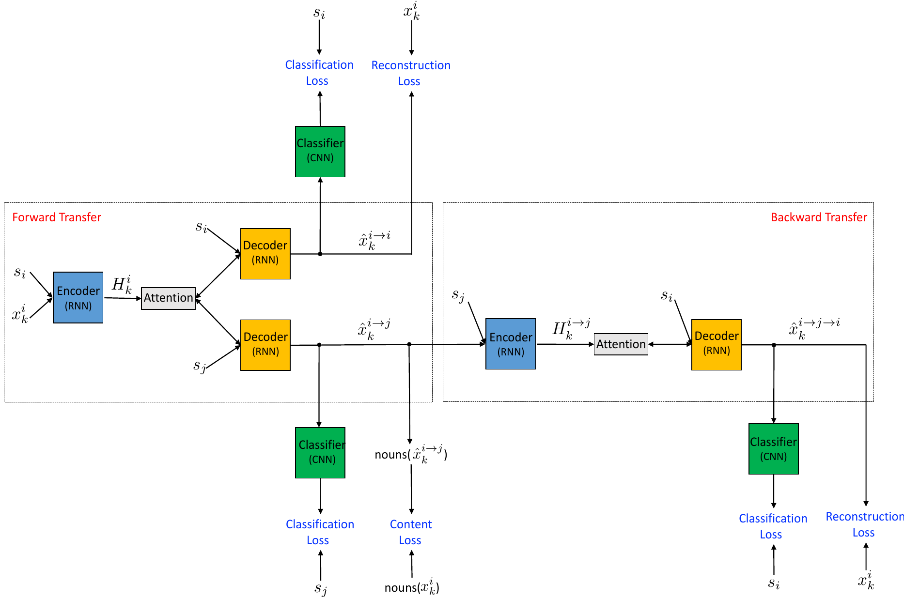

# Improved Neural Text Attribute Transfer with Non-parallel Data
---

## Idea
The authors attempt the disentanglement of sentiment and content in text, using a cycle loss and a collaborative classifier.

## Method
* Single encoder, decoder and classifier used.
* There is no adversarial discriminator used. Only a collaborative classifier is needed for this method.
* The encoder-decoder model (not a VAE) also uses attention to align the encoder and decoder outputs.
* The model works only for single attribute transfer.
* Decoding is done using a sequence of hidden states as opposed to a single latent vector as most other methods use.
* As shown in the below architecture, a sample sentence $x_i$ with label $i$ is transferred to $x_j$ with label, and the transferred back to $x_i$, using the cycle-loss from the [CycleGAN paper](https://arxiv.org/abs/1703.10593). This is supposed to help with the content preservation.
* Another content preservation regularization used is to not change the nouns in the original sentence when transferring.

### Model Architecture

### Experiments
* The Yelp and Amazon review data sets was used for the evaluation, with a max review length of 17 and 7 respectively
* The method seems to outperform the model in the [Cross-Alignment paper](https://arxiv.org/abs/1705.09655) in sentiment transfer and content preservation, but the perplexity scores are much worse.

## Observations
* Doing an ablation experiment on the attention mechanism might have been interesting, because although attention has been very successful for translation and dialogue tasks, if the structure of the sentence does not change much from encoder to decoder, the benefit of attention might not be substantial.
