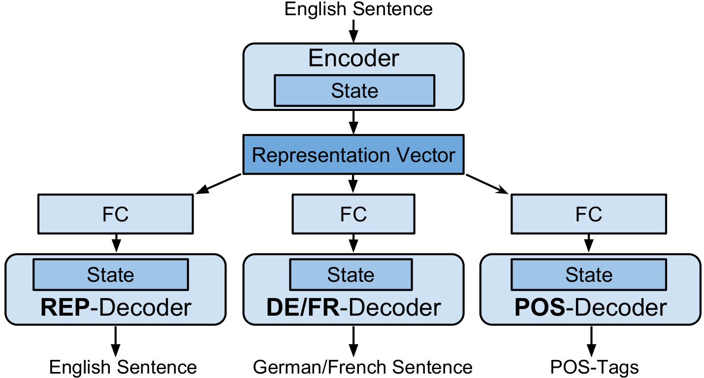

# Natural Language Multitasking: Analyzing and Improving Syntactic Saliency of Hidden Representations
---

## Idea

The authors make the claim that training autoencoded representation for multiple linguistics tasks, to improve the syntactic preservation in the representation.

The authors also claim that this leads to the ability to perform Word2Vec-style arithmetic that causes syntactic modifications to sentences.

## Method

* The main aspect of the method described is to use multiple latent representationa decoders for multiple tasks, which seems to cause the latent space to become more expressive in terms of capturing syntactic structures of the language.
* The authors make it clear that they're focusing on the learned representation and not the objectives that are being used to train the representation.
* The tasks being trained on are:
    * Reconstruction
    * POS-tagging
    * EN $\rightarrow$ FR translation
    * EN $\rightarrow$ DE translation
* LSTM RNNs are used for both the encoder and decoders. A character based RNN is used.
* The authors come up with 14 popular sentences templates that they try to cluster the sentences on, based on their latent representations.
* The loss metric of this clustering is the absolute number of sentences that were clustered incorrectly into one of the other 13 clusters.
* The clustering error drops with the inclusion of multiple tasks that the hidden representation needs to generalize to.

### Architecture

## Observations

* The assumption is made that since the task specific multi-decoder models receive more training input, it should use fewer training examples when compared to the main model.
* The authors attempt interpolated generation from the space between 2 sentences' latent representations, but the results aren't great. This could be attributed mainly to their usage of a character based language model.
* Very few of the arithmetic operations on the representation spaces actually work, and when they do, the sentences are very short ($<5$ words)
