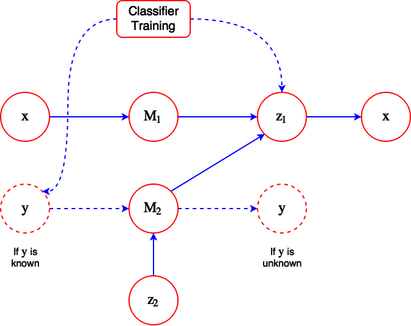

# Semi-supervised Learning with Deep Generative Models
---

## Idea

The authors aim to tackle the issue of insufficient labeled data in many domains that prompt the usage of semi-supervised learning.

The authors present a stochastic variational inference algorithm that allows for joint optimization of both model and variational parameters, and that is scalable to large data sets.

## Background

The simplest algorithms for semi-supervised learning is a self-training scheme in which the model is bootstrapped with training data, and the predictions made with high confidence are used as labeled examples in an iterative process. This method is heuristic and prone to errors because poor predictions might be reinforced.

## Method

The authors wish to use a variational autoencoder to compress the input representation and then classify the compressed representation. 

The encoder parameters are $\phi$ and the decoder parameters are $\theta$.

There are 2 components in the overall model:
* $M_1$: A latent discriminative model, which uses a Gaussian inference network $q_{\phi}(z\|x)$ to infer the latent variable $z$.
* $M_2$: A generative semi-supervised model which infers both $z$ and $y$, assuming that $q_{\phi}(z,y\|x)$ has the factorized form $q_{\phi}(z\|x) q_{\phi}(y\|x)$ specified as a Gaussian distribution for $z$ and a multinomial distribution for $y$.

The inference network $q_{\phi}(z\|x)$ is used on both the labeled and unlabeled data sets. The approximate posterior learned by the encoder is then used as a feature extractor to train the classifier.

$q_{\phi}(z,y\|x)$ can be treated as a continuous-discrete mixture model, since $z$ is a continuous Gaussian distribution and $y$ is a multinomial distribution.

### Experiment Setup
* Evaluated on MNIST
* AdaGrad was the learning algorithm used.

### Architecture

## Observations
* This paper contains one of the first neural approaches to style/content disentanglement.
* It is not clear to me why the probability distribution of the generated variable $x$ in model $M_2$ needs to be explicitly modeled as a Gaussian or Bernoulli distribution, since we already have the ground truth for $x$
* There is no regularization in the current model to ensure that content doesn't leak into the style representation.
