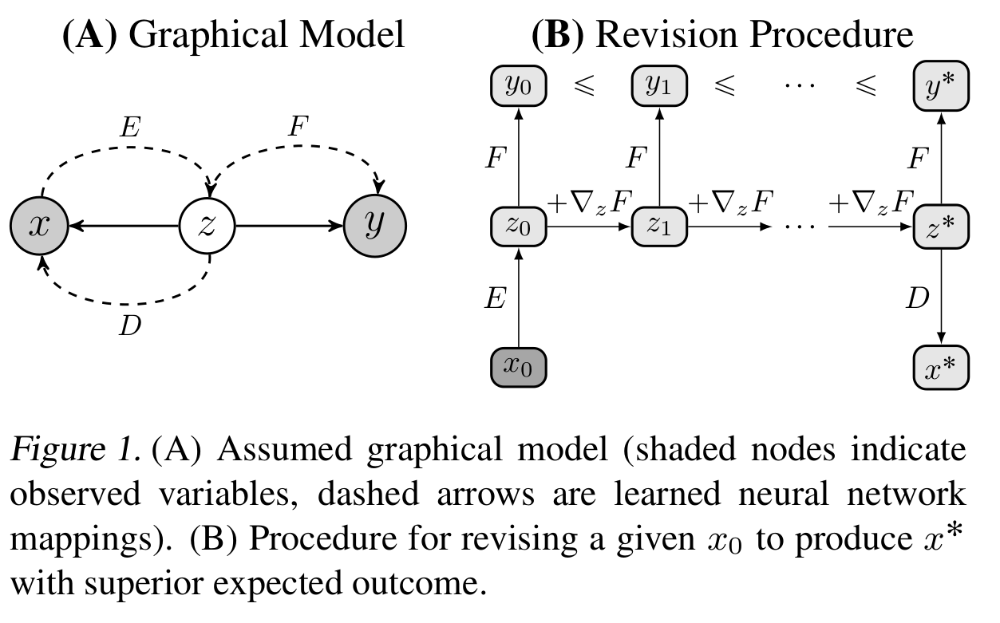

# Sequence to Better Sequence: Continuous Revision of Combinatorial Structures
---

## Idea
The authors present a recurrent network based variational auto-encoder that learns to transform sequences to maximize a given objective.

## Method
* The objective is to revise the decoded sentence to obtain a maximum value of the outcome variable, while still preserving the semantics of the original sentence. This is done using unaligned corpora.
* Instead of needing to solve a combinatorial space problem of re-arranging the words of the sentence, the improved sentence generation is approximated by shifting the latent representation of the sentences, as parameterized by neural networks.
* The model comprises of the original distribution $x$, the latent distribution $z$, and the outcome to be maximized $y$. Based on this, the model needs to come up with a corresponding $x^{*}$ which maximizes the outcome.
* The mapping of $x$ to $z$ and back to $x$ is parameterized by a VAE that is trained on reconstruction loss, as well as a KL-divergence loss to constrain the generative prior to a Gaussian distribution. Both the encoder and decoder are RNN networks.
* The outcome $y$ is predicted from $z$ using a feed-forward network, and trained using a mean-squared loss.
* To enforce the invariance of the encoder to already improved sequences, a cyclical loss is applied to ensure that $F(x)$ and $F(E(D(x)))$ are exactly the same where $F$ is the outcome predicting feed-forward network, $E$ is the encoder and $D$ is the decoder.
* During every training iteration, the latent representation $z$ is optimized to maximize the outcome $y$

### Experiments
The authors evaluate this model on 2 tasks: Revising sentence positivity, and modifying modern text into a Shakespearan style.

### Model

