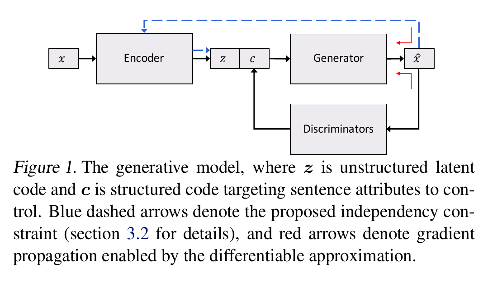
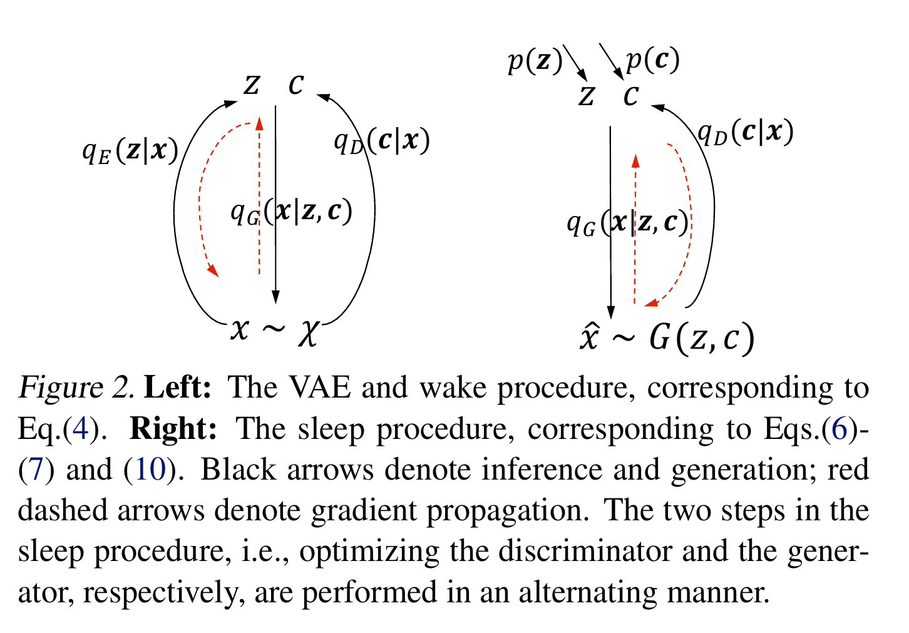

# Toward Controlled Generation of Text
---

## Idea

The authors aim to disentangle representations of style and content in the latent code of a Variational AutoEncoder. The style is called the **structured code** and is learned by discriminators for each attribute that needs to be disentangled from the latent space.

## Method
* This method does not use adversarial training.
* The basic approach can be described as below:
    * $x$ is the source corpus
    * The encoder is parameterized to generate a latent code $z$, which is a variational latent space that resembles a Gaussian prior. (This is enforced by a KL-divergence loss)
    * The structured code $c$ is a known label of the text (discrete or continouous)
    * The decoder generator produces the output corpus $\hat{x}$ conditioned on $(z, c)$. It uses greedy decoding.
    * A classifier/regressor discriminator predicts the structured code of the output corpus $\hat{x}$ to ensure that it is the same as the one the generator was conditioned on i.e. $G(z, c)$. The discriminator is pretrained.
    * Each decoder step in $\hat{x}$ is predicted using a softmax function scaled by a temperature $\tau$. Higher temperatures flatten the softmax distribution for each word prediction and increase word diversity. Conversely, setting $\tau = 0$ will resembled a hardmax. For their experiments the authors gradually anneal $\tau \rightarrow 0$
* The authors describe 3 separate losses to train their model.
    * A reconstruction loss that ensures that the generated sentence $\hat{x}$ is the same as the original sentence $x$. This is equivalent to minimizing the negative log-likelihood of generating $\hat{x}$.
    * A discriminator validates if the predicted class/value for $\hat{x}$ is the same as the corresponding class/value for $x$. This is a cross-entropy loss over the probability distribution of the labels. This discriminator loss can be further subdivided into 2 terms. 
        * Maximize the expected log likelihood of predicting the correct distribution of the structured code $c$ given the labelled examples $X_L$. This happens before the generator model training. 
        * Maximize the expected log likelihood of predicting the correct distribution of the structured code $c$ given the generated sentences $\hat{x}$. Also minimize the empirically observed Shannon entropy of the observed discriminator prediction $q_D(c'\|\hat{x})$, which reduces uncertainty and increases confidence of the structured code prediction.
    * The encoder from loss 1, is used to regenerate the latent distribution $z$ devoid of the structured code from the output distribution $\hat{x}$. The authors call this an **independence constraint**, in that regardless of the structured code $c$ that is currently present in either $x$ or $\hat{x}$, processing either through the generator should produce a consistent $z$. This allows the encoder to encode only latent factors that are independent of the structured code.
* [A wake-sleep algorithm](http://science.sciencemag.org/content/268/5214/1158) is used to alternatively train the generator and discriminator.
* The model was applied only to short sentences with length $<15$ words.
* The encoder/decoder setup is implemented using single layer LSTMs and the discriminator is implemented using conv-net. The KL term is annealed from 0 to 1 during training.

### Architecture

### Learning Process

## Observations
* The model performs better than the [S-VAE](http://papers.nips.cc/paper/5352-semi-supervised-learning-with-deep-generative-models) implementation in terms of sentiment accuracy of generated sentences.
* From the reported results, it seems that adding the independence constraint helps the generated sentences retain the content successfully.
