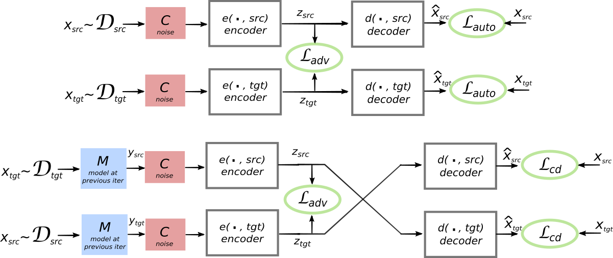

# Unsupervised Machine Translation Using Monolingual Corpora Only
---

## Idea
The authors propose a new neural machine translation system that uses non-parallel text from 2 different language and learns to translate simply training a reconstruction model along with a discriminator to aligh the latent spaces of the language models learnt for both languages.

## Method
* The core idea used is that the model should be able to construct a sentence in a language given a noisy version of that sentence in the same language.
* The proxy for the noisy version of the sentence is provided by a [previous work](https://arxiv.org/abs/1710.04087) which uses word-embedding space alignment to provide an unsupervised word-by-word translation framework. The result of this work is a generated bilingual lexicon, which can then be used to create a word-by-word translation in the target language, which can be considered 'noisy'. 
* From the above point, we can state that the encoder in this model is similar to a denoising autoencoder.
* The source and target sentence latent representations are constrained to have the same representation by an adversarial discrimator that is trained to differentiate one language from the other solely using their latent embedding.
* A single encoder and decoder is used for both domains and the parameters are shared. The attention weight parameters are also shared.
* The input to the decoder is a sequence of hidden states as opposed to a single fixed-size vector.
* The encoder and decoder are 3 layered bidirectional LSTMs. The decoder uses greedy decoding.
* While training the reconstruction tasks on the monolingual corpora, noise is added to the input data before feeding it into the encoder. This noisy data is supposed to resemble the noisy word-by-word translations from the other language that the model is expected to translate during inference.
* Word dropout and sentence shuffling has been used for regularization.
* The discriminator is trained to recognize which language the encoded representation is from. The input to the discriminator is a series of hidden LSTM states.
* Since this model operates on non-parallel corpora, an additional training signal is how  well it can translate and then re-translate a piece of text back to the original language.
* From the ablation studies, it was noted that the most important component was the inclusion the pretrained bilingual dictionary.

## Architecture

## Observations
* This is one of the first forays into completely unsupervised corpus machine translation. The method acheives a BLEU score of $32.76$ on an English-French translation task.
* First off, the title of the paper is very misleading. The title should say 'non-parallel' corpora instead of 'monolingual' corpora.
* The authors state that the discriminator is an MLP operating on the output of the encoder, which is a sequence of states. It is not clear if the states are simply flattened to be fed into the MLP or whether some other feature extractor is used.
