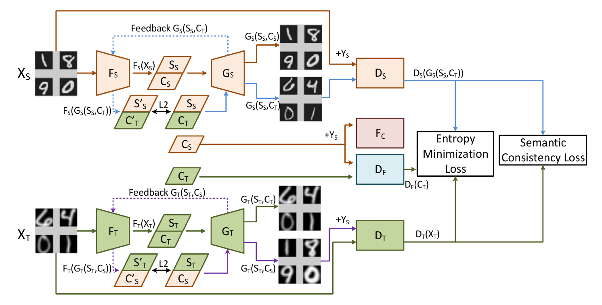

#  Domain Adaptation Meets Disentangled Representation Learning and Style Transfer

## Idea

The authors intend to learn both common and specific representatons of distinct handwriting styles, and then:
1. Use the common styles for domain adaptation.
2. Use the specific styles for style transfer.

## Method

* The dataset comprises of source images $S$, target images $T$, and a set of labels for only the source images $Y_S$.
* The general idea is to learn the representations of $S_C$ (content of source), $S_S$ (style of source) and similarly, $T_C$ and $T_S$ for the target respectively.
* Semantic consistency and entropy are the two metrics that are used to bring the content representations together into the same distribution.
* $F_S$ and $F_T$ are both feature extractors that try to disambiguate style from content.
* The generators $G_S$ and $G_T$ are given the style of their respective networks with content from both the source and target sets. The idea is to train them such that it is encouraged by the network to maintain separation of responsibilities between the style components $S$ and the content components $C$.
* $D_F$ is the adversarial component that tries to distinguisth between $C_S$ and $C_T$, which the main network tries to make indistinguishable.
* $F_C$ is a standard classifier that needs to be well trained on the supervised source data $X_S$ and corresponding labels $Y_S$.
* The source discriminator $D_S$ and the target discriminator $D_T$ both try to predict which among the real source image and the style-transferred image is the real deal.

## Observations

* The interesting aspect is the transfer learning of the labels done via cross-alignment of the two datasets.
* The closest comparison I could derive in NLP would be to learn paraphrases of sentences by stripping each of style and relying only on the content information in $C_S$ and $C_T$ for comparison.
